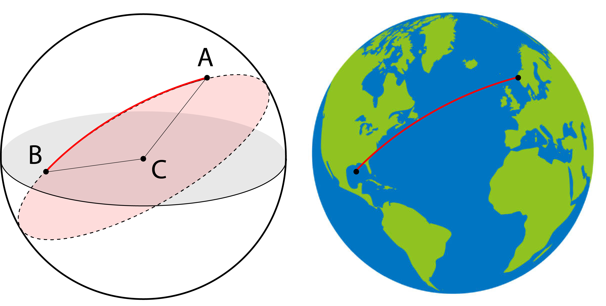

# Haversine Distance

Computes the [great-circle distance](https://en.wikipedia.org/wiki/Great-circle_distance) between two points on a sphere using
the Haversine formula. Useful for geographic distance calculations where
the curvature of the Earth matters.

---

## The Formula

Given two points $(\phi_1, \lambda_1)$ and $(\phi_2, \lambda_2)$ in
radians, the Haversine formula is:

$$
a = \sin^2\!\left(\frac{\Delta\phi}{2}\right)
  + \cos\phi_1 \cdot \cos\phi_2 \cdot \sin^2\!\left(\frac{\Delta\lambda}{2}\right)
$$

$$
c = 2 \cdot \arctan2\!\left(\sqrt{a},\, \sqrt{1-a}\right)
$$

$$
d = R \cdot c
$$

Where $R = 6{,}371$ km is the mean radius of the Earth and $d$ is the
distance between the two points.



---

## Single Distance

**`haversine(p1, p2)`**

- `p1` *(Coord)* — origin as `(latitude, longitude)` in decimal degrees
- `p2` *(Coord)* — destination as `(latitude, longitude)` in decimal degrees

*Returns* `float` — great-circle distance in kilometres

```python xp-source
import math
from typing import Tuple

EARTH_RADIUS_KM = 6_371.0

Coord = Tuple[float, float]  # (latitude_degrees, longitude_degrees)


def haversine(p1: Coord, p2: Coord) -> float:
    lat1, lon1 = math.radians(p1[0]), math.radians(p1[1])
    lat2, lon2 = math.radians(p2[0]), math.radians(p2[1])

    dlat = lat2 - lat1
    dlon = lon2 - lon1

    a = math.sin(dlat / 2) ** 2 + math.cos(lat1) * math.cos(lat2) * math.sin(dlon / 2) ** 2
    c = 2 * math.atan2(math.sqrt(a), math.sqrt(1 - a))
    return EARTH_RADIUS_KM * c
```

## Pairwise Distances

Given a list of coordinates, build a symmetric distance matrix.

The matrix entry $D_{ij}$ is the Haversine distance between point $i$
and point $j$, with $D_{ii} = 0$.

**`pairwise_distances(points)`**

- `points` *(list[Coord])* — list of `(latitude, longitude)` pairs in decimal degrees

*Returns* `list[list[float]]` — symmetric $n \times n$ distance matrix in kilometres

```python xp-source
def pairwise_distances(points: list[Coord]) -> list[list[float]]:
    n = len(points)
    matrix = [[0.0] * n for _ in range(n)]
    for i in range(n):
        for j in range(i + 1, n):
            d = haversine(points[i], points[j])
            matrix[i][j] = d
            matrix[j][i] = d
    return matrix
```

## Nearest Neighbour

Find the closest point to a query from a list of candidates.

**`nearest(query, candidates)`**

- `query` *(Coord)* — reference point as `(latitude, longitude)` in decimal degrees
- `candidates` *(list[Coord])* — points to search through

*Returns* `(int, float)` — index of the nearest candidate and its distance in kilometres

```python xp-source
def nearest(query: Coord, candidates: list[Coord]) -> Tuple[int, float]:
    best_idx, best_dist = 0, float("inf")
    for i, c in enumerate(candidates):
        d = haversine(query, c)
        if d < best_dist:
            best_dist = d
            best_idx = i
    return best_idx, best_dist
```

## Usage

```python
if __name__ == "__main__":
    cities = {
        "New York":   (40.7128, -74.0060),
        "London":     (51.5074,  -0.1278),
        "Tokyo":      (35.6762, 139.6503),
        "Sydney":     (-33.8688, 151.2093),
        "São Paulo":  (-23.5505, -46.6333),
    }

    names = list(cities.keys())
    coords = list(cities.values())

    print("Pairwise distances (km):\n")
    header = f"{'':>12}" + "".join(f"{n:>12}" for n in names)
    print(header)
    matrix = pairwise_distances(coords)
    for i, row in enumerate(matrix):
        print(f"{names[i]:>12}" + "".join(f"{d:>12.1f}" for d in row))

    print()
    idx, dist = nearest(cities["New York"], [cities[n] for n in names if n != "New York"])
    other = [n for n in names if n != "New York"]
    print(f"Nearest city to New York: {other[idx]} ({dist:.1f} km)")
```